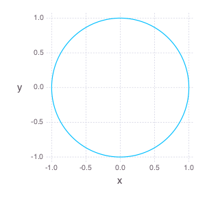

# RungeKutta.jl

A basic implementation of the Runge-Kutta ODE solver for systems of first order differential equations.

## Setup

There are no dependencies, just install with

```julia
	Pkg.clone("git://github.com/timothyrenner/RungeKutta.jl.git");
```
## Usage

The only function currently implemented is the `rk4f` function for a fourth order fixed width Runge-Kutta solution.

It's first argument is an array of functions of the form `f(t,x)` where `t` is the time (scalar) and `x` is the point (`Array`).
The functions in the array represent an iterative representation of the system of ODEs.
`f` should be defined such that `f[i](t, x_n) = x[i]_(n+1)` for each element `i` in the array of functions.
The idea is that applying each element of `f` to `x_n` results in a new vector `x_(n+1)`.

The second argument is the initial point (`x0`).
The third is the initial time (`t0`).
The fourth is the step size (`h`), and the fifth is the number of iterations (`n`).

The `rk4f` function returns a one dimensional array for the times, and a two dimensional array with each column being a solution point as a function of time.

If the length of `f` doesn't match the length of `x0`, an `ArgumentError` is thrown.
Also, if `n` or `h` is below zero, an `ArgumentError` is thrown. 

## Example

As an example, suppose we want to solve the simple harmonic oscillator equation.
It's a second order ODE that can be written as two coupled first order ODEs.

> x'' + x = 0

Written as two first order ODEs:

> x' = y
> 
> y' = -x

Therefore the `f` function array for this is

```julia

f = [(t,x) ->  x[2],
	 (t,x) -> -x[1]];
```

Putting everything together,

```julia

using RungeKutta

f = [(t,x) ->  x[2],
	 (t,x) -> -x[1]];
x0 = [0.0, 1.0];
t0 = 0.0;
h = 0.0001;
n = 100000;

t,x = rk4f(f, x0, t0, h, n);
```

This performs 100,000 iterations of the equations defined by `f`.




_Plots made with the awesome [Gadfly](https://github.com/dcjones/Gadfly.jl) package._